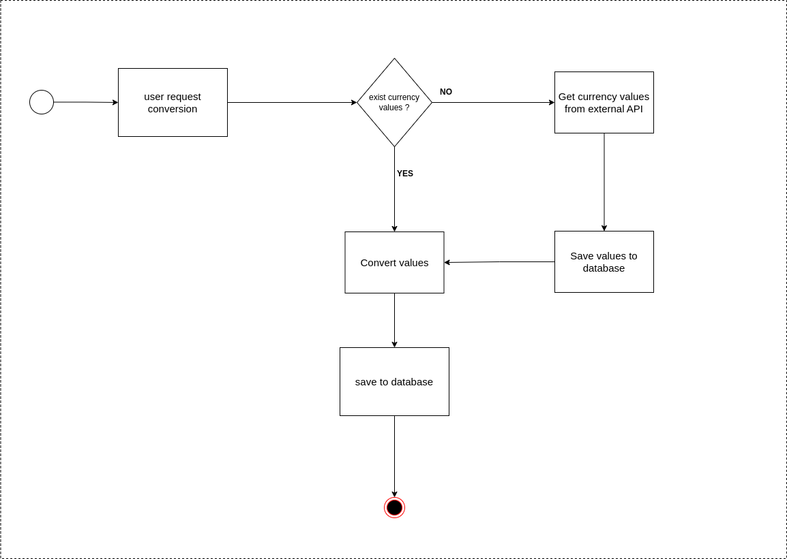

# Exchange Bureau Challenge

You have up to 2 hours to finish the challenge, you can use any IDE or text editor you want.

This project is designed for an exchange bureau.

A user requests the conversion of one currency into another, if the conversion value is not available in the system,
it must go to consult an external service, available at the following URL:

[External API Definition](https://rapidapi.com/neutrinoapi/api/convert-1/)

The user must enter the following data:

1. Currency of origin
2. Origin value
3. Destination currency
4. Destination value

Each time a conversion is performed, the result of the conversion must be stored in a table and the values of each
currency in another table.
in another.

## Requirements

1. You must have a form to perform the conversion.
2. Must have a table to show the conversions performed.
3. Must have a table to show the values of the currencies.

## Technologies

1. Java 1.8
2. SpringBoot 2.7.13
3. Thymeleaf

## Illustration

## Nice to have

If you want to add an extra to your project, we will greatly value if you add one or both of the following:

1. Bootstrap integration
2. Show the list of exchanges with Ajax/JQuery

